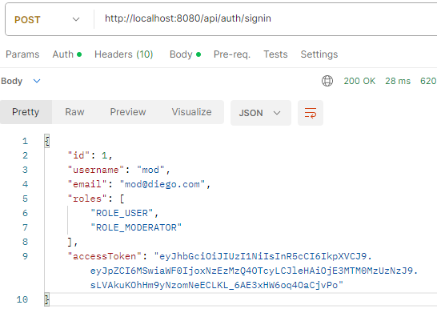
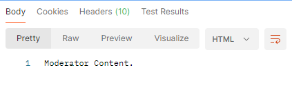
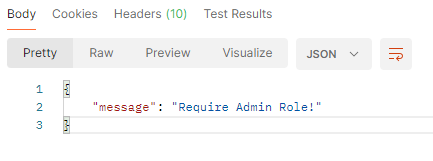

"# capacitaciónAPI"
  
En este ejercicio hice una especie de sistema que tiene tres diferentes roles para el usuario:
1. Administrador
2. Moderador
3. Usuario normal

Dependiendo de que rol tiene el usuario, podrá ver diferentes contenidos. En caso de que tenga más de un rol (Ej. Un usario Administrador que tambien sea Usuario Normal) podrá ver los contenidos dependiendo de los roles que tenga. 

Usa el JSON Web Token para retornar ciertas respuestas. Muestra como, después de que un usuario se haya logueado, el sistema devuelve el JWT y en base a ese token y al rol que se le haya asignado, el usuario obtendrá una respuesta. 
<html>
    

        
    

     
    

        
    

</html>

En caso de que no tenga el rol y quiera ver el contenido de un rol diferente aprecerá un mensaje que tiene que tener el permiso de ese rol
<html>
    

        
    

</html>
Aqui el usuario no tiene permiso de administrador, por lo que el sisteme devuelve un 403 y un mensaje diciendo que tiene que tener el rol de admin para poder ver el contenido

Por medio de API's se crean los usuario y se llaman los contenidos de cada rol. Los usuario se almacenan en una base de datos MYSQL en la cual hay tres tablas:
1. roles
2. users
3. user_roles

En la tabla "roles" están los diferentes tipos de roles que puede tener un usuario
<html>
    

        
    

</html>

En "users" están los usuarios creados. Está su id, nombre de usuario, email y contraseña (encriptada por medio de SHA-256), la fecha y hora de creación y actualización.
<html>
    

        
    

</html>

En "user_roles" muestra las claves primarias de las dos tablas anteriores (id de usuario e id de cada rol). La tabla muestra los roles que tiene cada usuario. La tabla muestra el id del usuario junto a su rol designado
<html>
    

        
    

</html>
